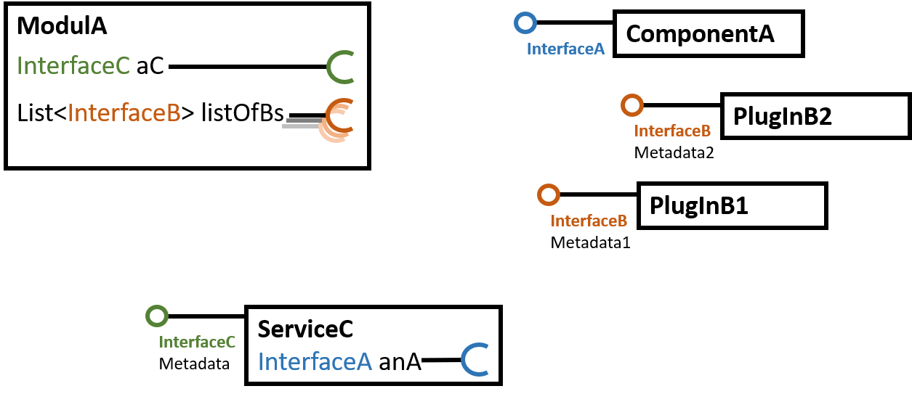
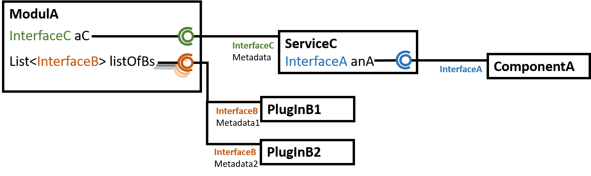

# Lektion 05 Reflection, Decompiler, Attribute, Dependency Injection

## Reflection, Definition

Bei "klassischen" Compilern, die aus einer Programmiersprache direkt in eine Maschinensprache
übersetzen, fallen während des Übersetzungsvorgangs viele programmiersprachliche Konstrukte weg.
Klassen, Interfaces,  Strukturen existieren im erzeugten Compilat ebensowenig wie
Hochsprachen-Kontroll-Anweisungen wie z.B. `if`-`else`, `for` oder `while`, stattdessen gibt es nur (bedingte) Sprunganweisungen. Aus diesem Grund
genügt es z.B. in C/C++ nicht, nur den kompilierten Code in Form von Libraries 
(DLLs, Archives, Libs, o.ä.) weiter zu geben. Zusätzlich müssen strukturelle Deklarationen wie 
Klassen oder Structs im Source-Code (in so genannten Header-Dateien (.h)) weiter gegeben werden.

In _managed_ Umgebungen wie Java oder C#/.NET sind auch hochsprachliche strukturelle deklarative
Informationen im erzeugten Kompilat (in .NET in einer_Assembly_, d.h. eine _managed DLL_ oder
_managed EXE_) enthalten.
Somit kann ein Compiler beim Compilieren von Source-Code, der auf bereits compilierten Code in einer
Library zugreift, alle zum Compilieren notwendigen Informationen (wie z.B. Klassen, Methoden,
Signaturen) aus der bereits kompilierten Library extrahieren.

Diese Informationen über in einer Assembly enthaltene Datentypen oder über die in einem Datentyp
enthaltenen Bestandteile können auch zur Laufzeit per Code abgefragt und ausgewertet werden.
Derartige _Meta_-Informationen über Programmcode und der Zugriff darauf zur Laufzeit wird 
***Reflection*** genannt.

Folgende Funktionalität steht Programmieren in einer Programmiersprache/-Umgebung, die Reflection ermöglicht, zur Verfügung:

- Compilezeit-Informationen zur Laufzeit auslesen
  - Welche Namespaces & Typen (Klassen, Strukturen, Enums) sind in 
    einem   Assembly (dll, exe) enthalten?
  - Welche Fields, Properties und Methoden sind in einer 
    Klasse / Struct enthalten?
  - Von welchem Typ ist ein Objekt 
  
- Compilezeit-Aktionen zur Laufzeit ausführen 
  - Instanzen von Typen erzeugen
  - Typisierte Instanzen von Generics erzeugen
  - Properties/Fields beschreiben und auslesen
  - Methoden aufrufen

## Reflection in C# verwenden

Die Reflection-Funktioinalität der .NET-Plattform steht im Namespace
[`System.Reflection`](https://msdn.microsoft.com/en-us/library/system.reflection(v=vs.110).aspx)
zur Verfügung. Der wichtigste Datentyp für den 
Umgang mit Reflection ist allerdings der zum `System`-Namespace
ist die Klasse 
[`System.Type`](https://msdn.microsoft.com/en-us/library/system.type(v=vs.110).aspx). 
Eine Instanz (ein Objekt) vom Typ `Type` bildet eine Sammlung von
zur Laufzeit abfragbaren Meta-Informationen über einen Datentyp.

> #### 👨‍🔧 TODO
>
> - Schaut Euch die Referenzdokumentation zu [`System.Type`](https://msdn.microsoft.com/en-us/library/system.type(v=vs.110).aspx)
>   an und beantwortet folgende Fragen:
>   - Wie bekommt man eine Liste der in einer Klasse definierten Methoden?
>   - Wie bekommt man eine Liste der in einer Klasse definierten Felder /
>     Eigenschaften?

### Einstieg

Um in eigenem Programmcode einen Einstieg in Reflection zu bekommen, 
benötigt man eine Instanz vom Typ `Type` die für den Datentyp, an dem 
man interessiert ist, beschreibende Metainformationen enthält. 

Es gibt drei grundlegende Möglichkeiten, an Instanzen von `Type` zukommen.

1. Mit dem `typeof`-Operator erhält man die ein `Type`-Objekt
   zu einem zur Compilezeit bekannten Typ.

1. Jedes beliebige Objekt in C# kann eine Instanz von `Type` liefern,
   die den Typ des Objektes beschreibt: Auf dem Datentyp `object`
   (der _Mutter aller Typen_) ist die Methode `Type GetType()` 
   deklariert.

2. Eine Assembly (DLL, EXE) kann zur Laufzeit geladen werden und
   dann per Reflection inspiziert werden, indem eine Liste der
   in der Assembly definierten Typen angefordert wird:
   - Assembly Laden: 
     [`Assembly.LoadFrom(string path)`](https://msdn.microsoft.com/en-us/library/1009fa28(v=vs.110).aspx)
   - Liste von Typen der Assembly: 
     [`Type[] GetTypes()`](https://msdn.microsoft.com/en-us/library/system.reflection.assembly.gettypes(v=vs.110).aspx)

> #### 👨‍🔧 TODO
>
> - Ruft auf Objekten von primitiven Datentypen (`int`, `string`)
>   die Methode `GetType()` auf und inspiziert den Inhalt der jeweils
>   zurückgegebenen Typ-Instanz mit dem Debugger oder gebt Informationen,
>   die von der Instanz abrufbar sind, per `WriteLine` aus.
> - Probiert das Ganze mit selbst definierten Datentypen. Nicht nur 
>   mit `class` und `struct`, sondern auch mit `enum` und `delegate`.
> - Schreibt eine Beispiel-Assembly (DLL oder EXE), in der ein oder 
>   mehrere Datentypen implementiert werden. Erzeugt ein weiteres 
>   (Konsolen-)Projekt, in dem Ihr die Beispiel-Assembly mit `LoadFrom`
>   (s.o) ladet und die enthaltenen Typen (`GetTypes`) abfragt und
>   von diesen ein paar Eigenschafte (z.B. Name) ausgebt. Tauscht die 
>   Beispiel-Assemblies _ohne_ Source-Code untereinander aus.

### Auslesen / Traversieren des Typsystems

Ausgehend vom `Type`-Objekt, das einen bestimmten Typ beschreibt, können sämtliche Eigenschaften abgefragt werden. Es ergibt sich eine Art Graph/Baum, in dem verwendete Typen, Methoden, Eigenschaften etc. als Knoten auftauchen. 

Beispiel: Eine Klasse enthält eine Methode, diese einen Parameter, dieser ist wiederum von einem anderen Typ, dieser wiederum enthält eine Eigenschaft wiederum eines anderen Typs etc.

Im Folgenden sind die beschreibende Strukturen des Reflection-Systems und deren 
jeweilige Eigenschaften/Get-Methoden aufgelistet, mit denen sich entlang des 
Typ-System-Graphen traversieren lässt.

- `Type`	
  - `FieldInfo[] GetFields()`  /  `FieldInfo GetField(string Name)`
  - `PropertyInfo[] GetProperties()`  / `PropertyInfo GetProperty(string Name)`
  - `MethodInfo[] GetMethods`  / `MethodInfo GetMethod(string Name)`
- `FieldInfo` / `PropertyInfo`
  - `string Name`
  - `Type FieldType`
- `MethodInfo`
  - `string Name`
  - `Type ReturnType`
  - `ParameterInfo[] GetParameters()`
  - `ParameterInfo`
  - `Type ParameterType`

> #### 👨‍🔧 TODO
>
> - Schreibt eine Methode `PrintTypeInfo(object o)`, die zu einem übergebenen Objekt
>   dessen komplette Typ-Informationen ausgibt, also u.A.
> - Ist es ein Delegate, ein Enum, eine Klasse oder ein Struct?
> - Falls Klasse oder Struct
>   - Alle `public` Methoden inkl Signaturen (Rückgabewert und Parameterliste)
>   - Alle `public` Properties und Felder inkl. deren jeweilige Typen.

### Über Reflection Aktionen ausführen

Neben dem reinen "Reflektieren", also Beschreiben, von Typinformationen können per
Reflection auch Aktionen ausgelöst werden. Es kann also aktiv mit den Typen gearbeitet 
werden, die zur Compilezeit gar nicht bekannt waren, und die zur Laufzeit nur über deren
beschreibede Strukturen bekannt sind. Folgende Aktionen sind möglich:

#### Objekte instanziieren
Mit der Methode `ConstructorInfo GetConstructor(Type[] paramTypes)` von `Type` kann ein
passenden Konstruktor gefunden werden. Mit der Methode `object Invoke(object[] parameters)`
der Klasse `ConstructorInfo`
kann dieser dann ausgeführt werden. Der Typ des zurückgegebenen Objektes entspricht dann
dem im ursprünglichen `Type` Objekt reflektierten Typ.

#### Fields/Properties lesen & beschreiben
Mit `object GetValue(object ob)`, deklariert sowohl in `PropertyInfo` als auch in `FieldInfo`
können die Inhalte von Properties oder Felder ausgelesen werden. Dabei ist das Objekt, 
auf dem das jeweilige Property deklariert ist, als Parameter zu übergeben.

Analog kann mit `void SetValue(object ob, object val)` der Wert eines Property oder eines Field
beschrieben werden. Auch hier ist das Objekt, das das zu beschreibende Element enthält,
als erster Parameter anzugeben, während die Methode `SetValue` auf dem reflektierenden
Objekt des Field oder Property aufzurufen ist. Der neu zu setzende Wert ist der zweite
Parameter.

#### Methoden aufrufen
Die Methode `object Invoke(object ob, object[] parameters)` auf Objekten vom Typ `MethodInfo`
erlaubt es, die reflektierte Methode auf dem als ersten Parameter zu übergebenden Objekt
aufzurufen. Die Parameter, die an die Methode übergeben werden sollen, müssen in den `object`-
Array (zweiter Parameter) verpackt werden.

> #### 👨‍🔧 TODO
>
> - Experimentiert mit per Reflection ausgelösten Methoden-Aufrufen und Wert-Zuweisungen an 
>   Felder/Properties. Erweitert z.B. die Methode `PrintTypeInfo(object o)` so, dass
>   sie alle öffentlichen Felder und Properties des übergebenen Objektes ausliest und deren Inhalte
>   mitausgibt.

### Typ-Überprüfungen

Oft soll überprüft werden, ob Objekte oder Typen miteinander in
einer Vererbungs-/Implementierungs-Beziehung stehen. Das geht zwar über Methoden
der Klasse `Type`, z.B. mit der 
[`Type BaseType`](https://msdn.microsoft.com/en-us/library/system.type.basetype(v=vs.110).aspx) 
Eigenschaft und der
[`Type[] GetInterfaces()`](https://msdn.microsoft.com/en-us/library/system.type.getinterfaces(v=vs.110).aspx) 
Methode, erfordert aber u.U. mehrere Zeilen Code, um in der Hierarchie zu traversieren 
oder in der Liste der Interfaces zu iterieren. Um direkt zu überprüfen, ob ein Typ von 
einem anderen abgeleitet ist oder ein bestimmtes Interface implementiert, können folgende
Mechanismen verwendet werden:

- [`is` Operator](https://docs.microsoft.com/en-us/dotnet/csharp/language-reference/keywords/is).
  Kann verwendet werden, wenn ein konkretes Objekt darauf überprüft
  werden soll, ob es von einem zur Compilezeit bekannten Typ erbt, ist oder implementiert.
  Beispiel: 

  ```C# 
  object o = ...;
  if (o is SomeType)
  {
    Console.WriteLine("o ist vom Typ SomeType");
  }
  ```

- [`Type.IsInstanceOfType()` Methode](https://msdn.microsoft.com/en-us/library/system.type.getinterfaces(v=vs.110).aspx).
  Kann verwendet werden, wenn ein konkretes Objekt darauf 
  überprüft werden soll, ob es von einem mit einer `Type`-Instanz beschriebenen Typ 
  erbt, ist oder implementiert. Der Typ, auf den geprüft wird,  muss somit zur Compilezeit 
  noch nicht feststehen. Beispiel:

  ```C# 
  Type typ = ...;
  object o = ...;
  if (typ.IsInstanceOfType(o))
  {
    Console.WriteLine("o ist vom Typ " + typ.Name);
  }
  ```

- [`Type.IsAssignableFrom()` Methode](https://docs.microsoft.com/en-us/dotnet/api/system.type.isassignablefrom?view=netframework-4.7.1#System_Type_IsAssignableFrom_System_Type_).
  Kann verwendet werden, wenn eine Vererbungs-
  oder Implementierungs-Beziehung zwischen zwei jeweils durch `Type`-Instanzen 
  beschriebene Typen überprüft werden soll. Keiner der beiden Typen muss zur Compilezeit
  fest stehen und es muss auch kein konkretes Objekt geben, das überprüft wird.
  **Achtung**: Reihenfolge beachten!
  Beispiel:

  ```C# 
  Type parentType = ...;
  Type childType = ...;
  if (parentType.IsAssignableFrom(childType))
  {
    Console.WriteLine(childType.Name + " implementiert oder erbt von " + parentType);
  }
  ```

## Reflection Einsetzen

### Wann sollte Reflection zum Einsatz kommen?

- So selten wie möglich!
- NIEMALS, wenn klassische Polymorphie (`virtual`) genausogut funktioniert!
- Reflection ist teuer!
- Zugriff erfordert String-Vergleiche, Look-Ups etc. 
- Nichts für zeitkritische inner-Loops!
- Wenn Reflection, dann am Besten nur während Initialisierungs-Routinen, Start-Up, etc.
  Ergebnisse von Reflection-Look-Ups zwischenspeichern.

### Einsatzbeispiele

- Dynamische Bindungen, die nicht mit Polymorphie lösbar sind
- Zur Laufzeit erzeugte Property-Graphen
- Generics-Instanziierungen, wenn T nicht zur Compilezeit bekannt ist
- Double-Dispatch, Multi-Dispatch-Szenarien (`virtual` ist single-Dispatch)
- Dynamische Konfiguration zur Start-Up-Zeit
  - PlugIn Mechanismen
  - Inversion-of-Control Container 
- Serialisierung von Objekt-Inhalten unbekannten Typs
- UI-Darstellung von Objekt-Inhalten unbekannten Typs

## Decompiler

Die in den Reflection-Informationen in jeder compilierten Einheit (_Assembly_ - DLL oder EXE)
vorhandenen Informationen lassen sich, gemeinsam mit den compilierten Anweisungen 
in der Intermediate Language, auch dazu verwenden, aus einer DLL oder einer EXE den
ursprünglichen Source Code wieder zu rekonstruieren. Da die enthaltenen Informationen
sehr reichhaltig sind, funktioniert das in vielen Fällen erstaunlich gut. Der ursprünglich
als Freeware von Lutz Röder entwickelten _.NET Reflector_ ist inzwischen nur gegen
Geld erhältlich. Das Produkt _dotPeek_ von JetBrains ist immerhin in einer
für Studenten und Hochschulen kostenlosen Version erhältlich.

> #### 👨‍🔧 TODO
>
> - Bildet Zweiergruppen. Erzeugt jeweils eine DLL mit beliebiger Funktionalität.
> - Tauscht die DLLs unterinander aus und findet mit dotPeek heraus, was die
>   DLL des jeweils anderen tut, indem Ihr den Sourcecode rekonstruiert. 

## Attribute

Die per Reflection zur Laufzeit über alle Code-Bestandteile abrufbaren Meta-Informationen
lassen sich durch eigene Informationen anreichern, die im Source-Code untergebracht
werden können und dann ebenfalls per Reflection aus dem compilierten Code abgefragt
werden können. In C# heißen diese Code-Annotationen ***Attribute***. 

Hierbei werden die Zusatzinformationen in eckigen Klammern jeweils vor das zu 
annotierende Code-Fragment gestellt. Annotierbare Code-Einheiten sind nahezu alle
möglichen deklarativen Bestandteile eines C#-Programms:

- Assemblies
- Namespaces
- Datentypen
  - Klassen
  - Structs
  - Interfaces
  - Enums
  - Delegates
- Bestandteile von Klassen, Structs und Interfaces
  - Properties
  - Felder
  - Methoden
  - Events
- Parameter von Methoden

### Code mit Attributen annotieren

Die im folgenden Beispiel deklarierte Klasse, die aus einer Methode und einem Feld besteht,
wurde an einigen Stellen mit Attributen um Informationen angereichert. Das Beispiel zeigt
die Syntax, wie Annotationen anzubringen sind.

```C#
[ClassInfo]
public class MyClass
{
  [MethodInfo]
  public void DoSomething([ParamInfo] int a);

  [FieldInfo]
  public int Number;
}
```

Die in den eckigen Klammern vorkommenden _Attribute_ sind dabei nicht beliebiger Text, sondern
müssen vorher als Klassen deklariert sein. Das .NET Framework enthält an die sechshundert (!)
vordefinierte Attribut-Klassen, um Code-Fragmente mit bestimmten Zusatzinformationen zu versehen. 
Hier nur drei Beispiele, wozu Attribute verwendet werden können:

1. **Methoden als _Obsolet_ kennzeichnen**. Bei der Weiterentwicklung von Klassenbibliothekten kann es 
   vorkommen, dass bestimmte Methoden in neuen Versionen nicht mehr enthalten sind. Um Anwender der
   Klassenbibliothek beim Versionswechsel davor zu bewahren, das bestehender Code, der die alten 
   Methoden noch verwendet, nicht mehr compiliert werden kann, können die Alten Methoden zunächst
   noch enthalten bleiben, aber mit dem 
   [`[Obsolete]`-Attribut](https://msdn.microsoft.com/en-us/library/system.obsoleteattribute(v=vs.110).aspx)
   gekennzeichnet werden. Der C#-Compiler erkennt dieses Attribut in referenzierten Bibliotheken und
   weist Anwender obsoleter Methoden mit einem _Warning_ darauf hin. 

2. **Struktur-Felder byte-genau ausrichten**. Mit `struct` deklarierte Datentypen können vom Compiler
   so organisiert werden, dass in Instanzen des Structs im Speicher des Rechners die enthaltenen 
   Felder an fest definierten Byte-Offsets stehen. Das kann nötig sein, wenn strukturierte Daten
   mit anderen, nicht in C# geschriebenen Software-Komponenten ausgetauscht werden sollen und das
   exakte Speicher-Layout eine Rolle spielt, z.B. bei Hardware-nahen Zugriffen über Gerätetreiber.
   Das Speicher-Layout der Struktur selbst kann mit dem 
   [`[StructLayout]`-Attribut](https://msdn.microsoft.com/en-us/library/system.runtime.interopservices.structlayoutattribute(v=vs.110).aspx)
   gesteuert werden. Noch expliziter kann das Byte-Offset einzelner Felder einer Struktur mit dem
   [`[FieldOffset]`-Attribut](https://msdn.microsoft.com/en-us/library/system.runtime.interopservices.fieldoffsetattribute(v=vs.110).aspx) beeinflusst werden.


3. **Automatische Serialisierung steuern**. Um Objekte und deren Inhalte auf Platte zu speichern oder 
   übers Netzwerk zu übertragen, müssen diese _serialisiert_ werden. Es gibt eine Reihe von Libraries,
   die die Inhalte von beliebigen Objekten per Reflection auslesen und diese serialisieren können,
   ohne dass dazu Code geschrieben werden muss. Um als Anwender dennoch steuern zu können, welche
   Objektinhalte wie serialisiert werden sollen, können diese mit Attributen annotiert werden. 
   So gibt es z.B. im .NET-Framework im 
   [Namespace `System.Xml.Serialization`](https://msdn.microsoft.com/en-us/library/system.xml.serialization(v=vs.110).aspx) 
   eine Reihe von Attributen, mit denen sich eine Serialisierung ins XML-Format steuern lässt.


### Eigene Attribute deklarieren

Damit eine selbst definierte Klasse als Attribut verwendet werden kann, _muss_ 

- ihr Klassenname mit dem Wort `Attribute` enden
- sie von der Klasse 
  [`System.Attribute`](https://msdn.microsoft.com/en-us/library/system.attribute.aspx) erben. 

Damit obiges Beispiel funktioniert, müssen also folgende Klassen deklariert sein:

```C#
public class ClassInfoAttribute  : Attribute { }
public class MethodInfoAttribute : Attribute { }
public class ParamInfoAttribute  : Attribute { }
public class FieldInfoAttribute  : Attribute { }
```

Neben der Verwendung von Attributen als reine Auszeichner (Attribut ist gesetzt oder nicht),
können auch Zusatzinformationen an Attributen gespeichert werden. Dazu können Attribut-Klassen
ganz normale, mit `public` ausgezeichnete Instanz-Felder oder -Properties haben. Diese 
Felder/Properties können bei der Verwendung des Attributs nach dem Attribut-Namen in runden 
Klammern verwendet werden, so dass die Attributverwendung dann einem Konstruktor-Aufruf 
ähnelt. Neben der Angabe von Parametern in tatsächlich deklarierten Konstruktoren, bei der 
die Parameter-Reihenfolge in der Parameterliste eine Rolle spielt, gibt es eine erweiterte
Syntax, die die Angabe initialer Werte über den Feld-Namen erlaubt.

### Verwendung von Attributen einschränken

Bei der Deklaration von Attributen kann bestimmt werden, an welchen Code-Bestandteilen (Assembly,
Namespace, Klasse, Struct, Methode, Feld, Property, Parameter, Rückgabewert) das deklarierte Attribut 
zum Einsatz kommen darf und wo nicht. Diese Eigenschaft wird wiederum über ein Attribut
gesteuert: Das 
[`[AttributeUsage]`-Attribut](https://docs.microsoft.com/en-us/dotnet/csharp/programming-guide/concepts/attributes/attributeusage)
kann bei der Deklaration einer Attribut-Klasse vorangestellt werden. Über dessen 
[[`ValidOn`]-Eigenschaft](https://docs.microsoft.com/en-us/dotnet/api/system.attributeusageattribute.validon?view=netframework-4.7.2)
kann festgelegt werden, an welchen Code-Bestandteielen das deklarierte Attribut verwendet werden darf.

### Attribute per Reflection zur Laufzeit auslesen

Attribute können zur Laufzeit ausgelesen werden. Dazu gibt bieten sowohl die unterschiedlichen 
beschreibenden Reflection-Klassen (Assembly, Type, MemberInfo, MethodInfo, ...) als auch die 
Attribtute-Klasse selbst Methoden an. 

> #### 👨‍🔧 TODO
> - Lest den Artikel 
>   [Zugriff auf Attribute mit Reflektion](https://docs.microsoft.com/de-de/dotnet/csharp/programming-guide/concepts/attributes/accessing-attributes-by-using-reflection)
>   aus dem C#-Programmierhandbuch und vollzieht das Beispiel, ggf. mit eigenen Klassen und Attributen, nach.
> - Identifiziert weitere Methoden zum Zugriff auf Attribute in o.g. Reflection-Klassen.

## Anwendungsbeispiel: Plug-In-Framework / Dependency Injection

Eine Anwendungsmöglichkeit von Reflection, vor allem im Zusammenhang mit Attributen,
sind dynamische Plug-In-Frameworks. Oft lassen sich Applikationen durch Plug-Ins
erweitern. Dafür legt die Applikation ein oder mehrere Interfaces fest, die von
Plug-In-Autoren implementiert werden können. Die im Interface geforderten Methoden
sind dann im Plug-In implementiert. Die Applikation kann dann von jeder 
Plugin-Klasse eine oder mehrere Instanzen anlegen und die per Interface 
"vertraglich gesicherten" Methoden zu gegebener Zeit aufrufen. 

Allerdings muss die Applikation zur Laufzeit (meist bei Programmstart) irgendwie die 
zur Verfügung stehenden Klassen, die im Plug-In implementiert werden, finden und
instanziieren. Zur Compilezeit haben die Applikationsentwickler jedoch keine 
Kenntnis über mögliche Plug-In-Klasse, daher können die Klassen nicht direkt
referenziert und instanzieiert werden. 

Hier kann Reflection helfen: Mit der `Assembly.LoadFrom`-Methode (s.o.) können
z.B. alle .dll-Dateien, die in einem festgelegten Plug-In-Verzeichnis liegen
zu Programmstart geladen werden und mit `GetTypes()` können alle in der DLL
implementierten Klassen untersucht werden, z.B. daraufhin, ob diese ein 
bestimmtes Interface implementieren, und/oder ob diese mit einem bestimmten
Attribut annotiert wurden, und/oder ob diese eine bestimmte Methode 
enthalten, die durch Namen, Signatur und/oder Attributierung identifiziert
werden kann.

Das Calculator-Beispiel im Verzeichnis dieser Lektion zeigt, wie das 
funktionieren kann.

Weiterführende Konzepte finden nicht nur die möglichen Komponenten (Plug-Ins),
sondern auch die Stellen, an die mit Instanzen dieser Komponenten 
initialisiert werden sollen (z.B. eine Liste von Operationen im Calculator)
automatisiert über Reflection (z.B. weil an der Liste der Operatoren ein
entsprechendes Attribut steht), darüber hinaus kann das Auffinde- und 
Initialisierungs-Verhalten oft mit weiteren Attributen oder Attribut-Parametern
gesteuert werden. 

### Definition Dependency Injection
Es gibt eine Reihe von Libraries, die diese Mechanik 
bereits implementieren. Hier spricht man von Dependency-Injection-Frameworks (DI).
Allgemein gesprochen lässt sich die Aufgabe von DI wie folgt beschreiben.

Zur Start-Up-Zeit liegen eine Reihe von _Komponenten_ und eine Reihe von Konsumenten
solcher Komponenten ohne feste Bindung vor:



Durch Dependency Injection werden auf Grund der Interfaces, die einerseits von 
den Komponenten implementiert werden, und andererseits von Konsumenten gefordert
werden (z.B. in Properties, Methodenparametern, Konstruktor-Parametern etc.),
gegebenenfalls präzisiert durch zusätzliche Attribute, die Verbindungen hergestellt.




### Beispiel DI-Frameworks

Bekannte Vertreter in C# / .NET sind:

- `System.ComponentModel.Composition` (Leider nicht Bestandteil von .NET Core)
  - a.k.a **MEF** (Managed Extensibility Framework). 
  - Bildet u.A. die Plug-In-Fähigkeit von Visual Studio (IDE, nicht Code).
- [Unity](https://github.com/unitycontainer/unity) (nicht die GameEngine)


## Weitere Anwendungsbeispiele für Reflection

- Serialisierung, z.B: mit System.SerializableAttribute oder mit mit Protobuf
- 


